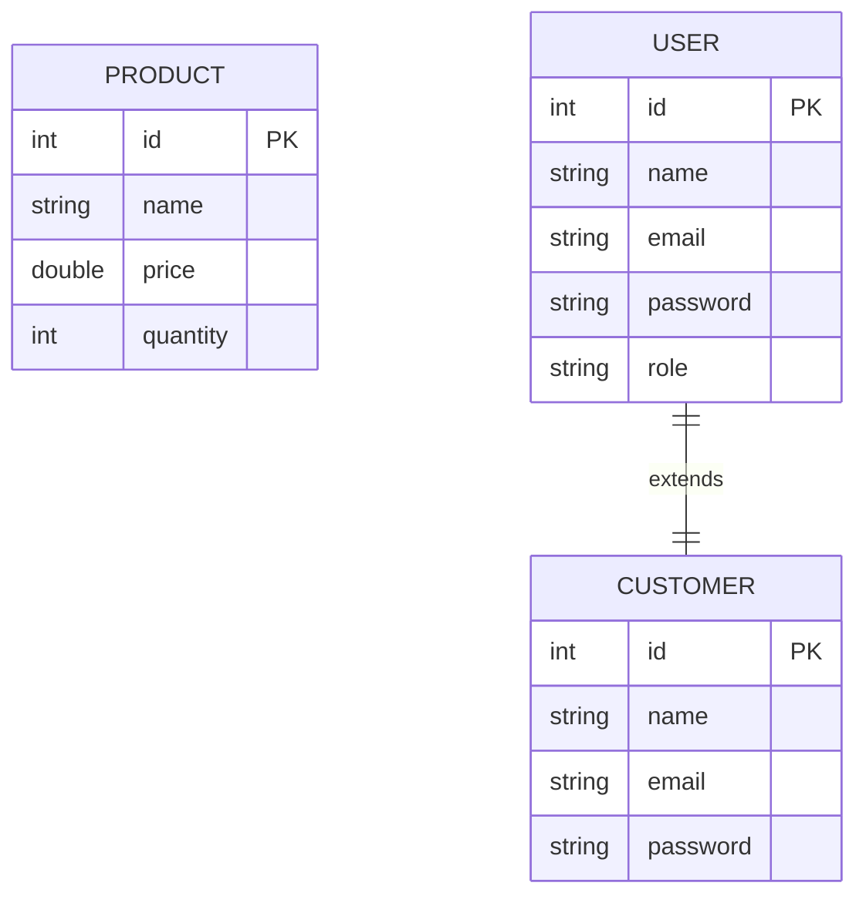

# Entity-Relationship Diagram

This repository models a simple shop domain with products and users.

`Product` is a standalone entity representing items in the shop.
`User` is an abstract base entity and `Customer` extends it with a concrete role.

