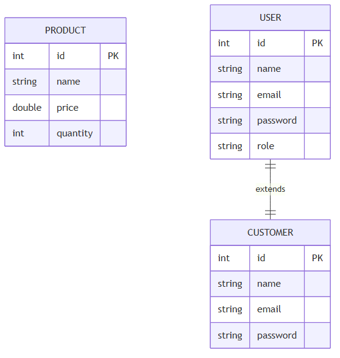

# Shop MVP

Minimal Java command-line product viewer for the reduced MVP.

## Run

```powershell
cd d:\java\capstone
javac -d out src\Main.java src\model\Product.java src\model\User.java src\model\Customer.java src\service\ProductService.java src\service\UserService.java
java -cp out Main
```

## ER Diagram

See the ER diagram in `ERD.md` or view the generated image below:



This starts a simple CLI that lets you:
- view available products
- add a product
- find a product by ID
- remove a product by ID
- view seeded users
- add a user
- find a user by ID

No database or web server is required.
