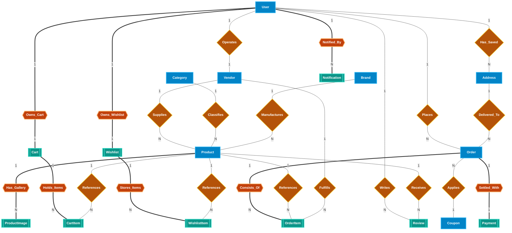
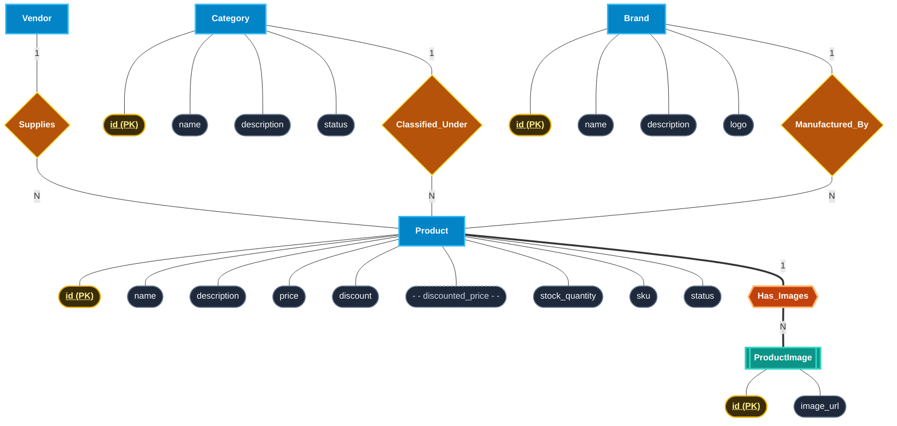
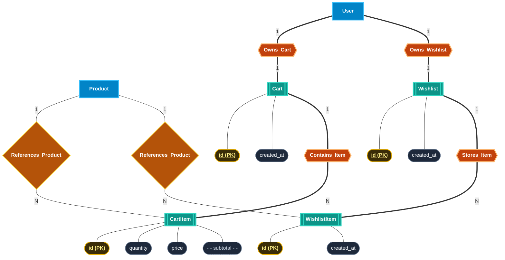

# Traditional Entity-Relationship (ER) Diagram (Peter Chen's Geometric Notation)
**Project:** BuyIt Marketplace — Multi-Vendor E-Commerce Platform  
**System:** Full Multi-Vendor Marketplace with Seller Dashboard, Secure Orders, Catalog & Payments

---

## 1. Traditional ER Diagram Legend & Shape Conventions (Peter Chen's Standard)

In classic Peter Chen Entity-Relationship modeling, databases are visually represented strictly using geometric shapes:

| Shape | Symbol Name | Description in Model | BuyIt Marketplace Examples |
| :--- | :--- | :--- | :--- |
| **Rectangle** `[ ... ]` | **Strong Entity** | Real-world object possessing independent existence | `User`, `Vendor`, `Category`, `Brand`, `Product`, `Order`, `Address`, `Coupon` |
| **Double Rectangle** `[[ ... ]]` | **Weak Entity** | Entity whose existence depends on an owner entity | `ProductImage`, `Cart`, `CartItem`, `Wishlist`, `WishlistItem`, `OrderItem`, `Payment`, `Review`, `Notification` |
| **Diamond** `{ ... }` | **Relationship** | Active association between strong entities | `Operates`, `Supplies`, `Classifies`, `Manufactures`, `Places`, `Delivered_To`, `Writes`, `Receives`, `Applies` |
| **Double Diamond** `{{ ... }}` | **Identifying Relationship** | Connects a weak entity to its owner entity | `Has_Gallery`, `Owns_Cart`, `Holds`, `Owns_Wishlist`, `Stores`, `Consists_Of`, `Settled_With`, `Notified_By` |
| **Oval / Ellipse** `( ... )` | **Attribute** | Characteristic property describing an entity or relationship | `name`, `price`, `stock_quantity`, `approval_status`, `order_status`, `discount` |
| **Underlined Oval** `( <u>...</u> )` | **Key Attribute (PK / UK)** | Uniquely identifies an entity instance | `<u>id</u>`, `<u>email</u>`, `<u>code</u>`, `<u>sku</u>` |
| **Double Oval** `(( ... ))` | **Multivalued Attribute** | Attribute containing multiple values for an entity | `(( product_images ))`, `(( phone_numbers ))`, `(( user_roles ))` |
| **Dashed Oval** `(- - ... - -)` | **Derived Attribute** | Computed from existing stored attributes | `(- - discounted_price - -)`, `(- - final_amount - -)`, `(- - subtotal - -)` |
| **Connecting Lines** `---` | **Link / Cardinality** | Connects attributes to entities & entities to relationships | `1` (One) to `N` (Many), `M` (Many), `1` to `1` |

---

## 2. High-Level Master ER Diagram (All 17 Entities & Key Relationships)

This master diagram shows the overall topology and associations between all system entities using traditional Chen geometric shapes:

---

## 3. Subsystem Detailed ER Diagrams (With Attributes & Keys)

To keep diagrams crisp, legible, and suitable for academic/technical reviews, the schema is decomposed into 4 detailed module diagrams featuring **all Chen geometric shapes**:
- **Rectangles** for Entities
- **Diamonds** for Relationships
- **Ovals** for Attributes
- **Underlined Text** for Primary Keys
- **Dashed Ovals** for Derived Attributes

---

### Subsystem A: User, Vendor & Address Profile

```mermaid
flowchart TD
    %% Styles
    classDef strongEntity fill:#0284c7,stroke:#38bdf8,stroke-width:2.5px,color:#ffffff,font-weight:bold;
    classDef weakEntity fill:#0d9488,stroke:#2dd4bf,stroke-width:3px,color:#ffffff,font-weight:bold;
    classDef relDiamond fill:#b45309,stroke:#fde047,stroke-width:2px,color:#ffffff,font-weight:bold;
    classDef idRelDiamond fill:#c2410c,stroke:#fdba74,stroke-width:3px,color:#ffffff,font-weight:bold;
    classDef attrOval fill:#1e293b,stroke:#64748b,stroke-width:1.5px,color:#f8fafc;
    classDef pkAttr fill:#3b2d08,stroke:#eab308,stroke-width:2px,color:#fef08a,font-weight:bold;

    %% Entities
    User["User"]:::strongEntity
    Vendor["Vendor"]:::strongEntity
    Address["Address"]:::strongEntity
    Notif[["Notification"]]:::weakEntity

    %% Relationships
    R_Operates{"Operates"}:::relDiamond
    R_HasAddr{"Has_Saved"}:::relDiamond
    R_Notif{{"Receives_Alert"}}:::idRelDiamond

    %% User Attributes
    U_id(["<u>id (PK)</u>"]):::pkAttr
    U_name(["name"]):::attrOval
    U_email(["<u>email (UK)</u>"]):::pkAttr
    U_phone(["phone"]):::attrOval
    U_pass(["password"]):::attrOval
    U_role(["role"]):::attrOval
    U_stat(["status"]):::attrOval
    U_created(["created_at"]):::attrOval

    User --- U_id
    User --- U_name
    User --- U_email
    User --- U_phone
    User --- U_pass
    User --- U_role
    User --- U_stat
    User --- U_created

    %% Vendor Attributes
    V_id(["<u>id (PK)</u>"]):::pkAttr
    V_bname(["business_name"]):::attrOval
    V_oname(["owner_name"]):::attrOval
    V_desc(["description"]):::attrOval
    V_city(["city"]):::attrOval
    V_state(["state"]):::attrOval
    V_pin(["pincode"]):::attrOval
    V_appr(["approval_status"]):::attrOval

    Vendor --- V_id
    Vendor --- V_bname
    Vendor --- V_oname
    Vendor --- V_desc
    Vendor --- V_city
    Vendor --- V_state
    Vendor --- V_pin
    Vendor --- V_appr

    %% Address Attributes
    A_id(["<u>id (PK)</u>"]):::pkAttr
    A_name(["full_name"]):::attrOval
    A_line(["address_line"]):::attrOval
    A_city(["city"]):::attrOval
    A_state(["state"]):::attrOval
    A_pin(["pincode"]):::attrOval
    A_def(["is_default"]):::attrOval

    Address --- A_id
    Address --- A_name
    Address --- A_line
    Address --- A_city
    Address --- A_state
    Address --- A_pin
    Address --- A_def

    %% Notification Attributes
    N_id(["<u>id (PK)</u>"]):::pkAttr
    N_title(["title"]):::attrOval
    N_msg(["message"]):::attrOval
    N_type(["type"]):::attrOval
    N_read(["is_read"]):::attrOval

    Notif --- N_id
    Notif --- N_title
    Notif --- N_msg
    Notif --- N_type
    Notif --- N_read

    %% Relationships
    User ---|"1"| R_Operates ---|"1"| Vendor
    User ---|"1"| R_HasAddr ---|"N"| Address
    User ===|"1"| R_Notif ===|"N"| Notif
```

---

### Subsystem B: Product Catalog, Brands & Categories

---

### Subsystem C: Shopping Cart & Wishlist

---

### Subsystem D: Orders, Multi-Vendor Order Items, Payments & Reviews

```mermaid
flowchart TD
    %% Styles
    classDef strongEntity fill:#0284c7,stroke:#38bdf8,stroke-width:2.5px,color:#ffffff,font-weight:bold;
    classDef weakEntity fill:#0d9488,stroke:#2dd4bf,stroke-width:3px,color:#ffffff,font-weight:bold;
    classDef relDiamond fill:#b45309,stroke:#fde047,stroke-width:2px,color:#ffffff,font-weight:bold;
    classDef idRelDiamond fill:#c2410c,stroke:#fdba74,stroke-width:3px,color:#ffffff,font-weight:bold;
    classDef attrOval fill:#1e293b,stroke:#64748b,stroke-width:1.5px,color:#f8fafc;
    classDef pkAttr fill:#3b2d08,stroke:#eab308,stroke-width:2px,color:#fef08a,font-weight:bold;
    classDef derivedAttr fill:#1e293b,stroke:#94a3b8,stroke-width:1.5px,stroke-dasharray:4 3,color:#cbd5e1;

    %% Entities
    User["User"]:::strongEntity
    Address["Address"]:::strongEntity
    Vendor["Vendor"]:::strongEntity
    Product["Product"]:::strongEntity
    Coupon["Coupon"]:::strongEntity
    Order["Order"]:::strongEntity
    OrderItem[["OrderItem"]]:::weakEntity
    Payment[["Payment"]]:::weakEntity
    Review[["Review"]]:::weakEntity

    %% Relationships
    R_Places{"Places"}:::relDiamond
    R_Delivered{"Ships_To"}:::relDiamond
    R_Applies{"Applies"}:::relDiamond
    R_Consists{{"Consists_Of"}}:::idRelDiamond
    R_Fulfills{"Fulfills"}:::relDiamond
    R_OrderedProd{"References"}:::relDiamond
    R_Settled{{"Settled_With"}}:::idRelDiamond
    R_Writes{"Writes"}:::relDiamond
    R_Evaluates{"Evaluates"}:::relDiamond

    %% Order Attributes
    O_id(["<u>id (PK)</u>"]):::pkAttr
    O_tot(["total_amount"]):::attrOval
    O_ship(["shipping_amount"]):::attrOval
    O_disc(["discount_amount"]):::attrOval
    O_fin(["- - final_amount - -"]):::derivedAttr
    O_paystat(["payment_status"]):::attrOval
    O_ordstat(["order_status"]):::attrOval
    O_created(["created_at"]):::attrOval

    Order --- O_id
    Order --- O_tot
    Order --- O_ship
    Order --- O_disc
    Order --- O_fin
    Order --- O_paystat
    Order --- O_ordstat
    Order --- O_created

    %% OrderItem Attributes
    OI_id(["<u>id (PK)</u>"]):::pkAttr
    OI_name(["product_name"]):::attrOval
    OI_price(["price"]):::attrOval
    OI_qty(["quantity"]):::attrOval
    OI_sub(["- - subtotal - -"]):::derivedAttr
    OI_stat(["item_status"]):::attrOval

    OrderItem --- OI_id
    OrderItem --- OI_name
    OrderItem --- OI_price
    OrderItem --- OI_qty
    OrderItem --- OI_sub
    OrderItem --- OI_stat

    %% Payment Attributes
    Pay_id(["<u>id (PK)</u>"]):::pkAttr
    Pay_meth(["payment_method"]):::attrOval
    Pay_tx(["transaction_id"]):::attrOval
    Pay_amt(["amount"]):::attrOval
    Pay_stat(["payment_status"]):::attrOval
    Pay_date(["payment_date"]):::attrOval

    Payment --- Pay_id
    Payment --- Pay_meth
    Payment --- Pay_tx
    Payment --- Pay_amt
    Payment --- Pay_stat
    Payment --- Pay_date

    %% Coupon Attributes
    Cp_id(["<u>id (PK)</u>"]):::pkAttr
    Cp_code(["<u>code (UK)</u>"]):::pkAttr
    Cp_dtype(["discount_type"]):::attrOval
    Cp_val(["discount_value"]):::attrOval
    Cp_min(["minimum_amount"]):::attrOval

    Coupon --- Cp_id
    Coupon --- Cp_code
    Coupon --- Cp_dtype
    Coupon --- Cp_val
    Coupon --- Cp_min

    %% Review Attributes
    Rev_id(["<u>id (PK)</u>"]):::pkAttr
    Rev_rating(["rating"]):::attrOval
    Rev_comm(["comment"]):::attrOval
    Rev_stat(["status"]):::attrOval

    Review --- Rev_id
    Review --- Rev_rating
    Review --- Rev_comm
    Review --- Rev_stat

    %% Connections
    User ---|"1"| R_Places ---|"N"| Order
    Address ---|"1"| R_Delivered ---|"N"| Order
    Coupon ---|"1"| R_Applies ---|"N"| Order
    Order ===|"1"| R_Consists ===|"N"| OrderItem
    Product ---|"1"| R_OrderedProd ---|"N"| OrderItem
    Vendor ---|"1"| R_Fulfills ---|"N"| OrderItem
    Order ===|"1"| R_Settled ===|"1"| Payment

    User ---|"1"| R_Writes ---|"N"| Review
    Product ---|"1"| R_Evaluates ---|"N"| Review
```

---

## 4. Entity-Relationship Data Dictionary & Cardinality Ratios

| Relationship Name | Connecting Entities | Traditional Shapes Used | Cardinality Ratio | Business Logic & Rules |
| :--- | :--- | :--- | :---: | :--- |
| **Operates** | `User` &harr; `Vendor` | Rectangle &harr; Diamond &harr; Rectangle | `1 : 1` | A user with role `VENDOR` manages exactly one store profile. |
| **Has_Saved** | `User` &harr; `Address` | Rectangle &harr; Diamond &harr; Rectangle | `1 : N` | A customer can register multiple shipping addresses. |
| **Notified_By** | `User` &harr; `Notification` | Rectangle &harr; Double Diamond &harr; Double Rectangle | `1 : N` | System dispatches notifications to individual users. |
| **Supplies** | `Vendor` &harr; `Product` | Rectangle &harr; Diamond &harr; Rectangle | `1 : N` | Vendors publish and supply multiple catalog products. |
| **Classified_Under** | `Category` &harr; `Product` | Rectangle &harr; Diamond &harr; Rectangle | `1 : N` | Each product belongs to an active category. |
| **Manufactured_By** | `Brand` &harr; `Product` | Rectangle &harr; Diamond &harr; Rectangle | `1 : N` | Products are manufactured/branded under a specific brand. |
| **Has_Gallery** | `Product` &harr; `ProductImage` | Rectangle &harr; Double Diamond &harr; Double Rectangle | `1 : N` | Weak entity: images exist solely as part of a product gallery. |
| **Owns_Cart** | `User` &harr; `Cart` | Rectangle &harr; Double Diamond &harr; Double Rectangle | `1 : 1` | Each customer has exactly one persistent shopping cart. |
| **Holds_Items** | `Cart` &harr; `CartItem` | Double Rectangle &harr; Double Diamond &harr; Double Rectangle | `1 : N` | Cart holds multiple product line items. |
| **Owns_Wishlist** | `User` &harr; `Wishlist` | Rectangle &harr; Double Diamond &harr; Double Rectangle | `1 : 1` | Each customer has a saved wishlist. |
| **Stores_Items** | `Wishlist` &harr; `WishlistItem` | Double Rectangle &harr; Double Diamond &harr; Double Rectangle | `1 : N` | Wishlist stores favorited products. |
| **Places** | `User` &harr; `Order` | Rectangle &harr; Diamond &harr; Rectangle | `1 : N` | Customers place orders during checkout. |
| **Ships_To** | `Address` &harr; `Order` | Rectangle &harr; Diamond &harr; Rectangle | `1 : N` | Each order is fulfilled to a verified delivery address. |
| **Consists_Of** | `Order` &harr; `OrderItem` | Rectangle &harr; Double Diamond &harr; Double Rectangle | `1 : N` | Multi-item checkout: orders break down into order items. |
| **Fulfills** | `Vendor` &harr; `OrderItem` | Rectangle &harr; Diamond &harr; Double Rectangle | `1 : N` | Individual vendors pack and dispatch their specific items. |
| **Settled_With** | `Order` &harr; `Payment` | Rectangle &harr; Double Diamond &harr; Double Rectangle | `1 : 1` | Order records payment transaction (COD, UPI, Card, Net Banking). |
| **Writes** | `User` &harr; `Review` | Rectangle &harr; Diamond &harr; Double Rectangle | `1 : N` | Verified customers write reviews and rate products (1 to 5). |
| **Evaluates** | `Product` &harr; `Review` | Rectangle &harr; Diamond &harr; Double Rectangle | `1 : N` | Each review provides feedback for a specific product. |
| **Applies** | `Coupon` &harr; `Order` | Rectangle &harr; Diamond &harr; Rectangle | `1 : N` | Promotional discount code applied to calculate final order amount. |

---

## 5. Visual Artifacts Generated in Project

To facilitate academic presentation, viva defense, and formal documentation:

1. **Interactive Visualizer:** [docs/er_diagram_traditional.html](file:///d:/java/capstone/docs/er_diagram_traditional.html)
   - Real-time SVG rendering of all Peter Chen geometric shapes.
   - Smooth **Pan & Zoom** navigation controls with mini-map and reset.
   - **Filter by Subsystem** buttons (All, Identity & Vendors, Catalog, Orders & Checkout, Engagement).
   - Click-to-inspect sidebar detailing primary keys, attributes, and foreign relations.
2. **Standalone Vector Diagram:** [docs/er_diagram_traditional.svg](file:///d:/java/capstone/docs/er_diagram_traditional.svg)
   - Clean 2800&times;1900 high-res vector diagram with distinct color-coding for strong entities, weak entities, relationships, attributes, and keys.
