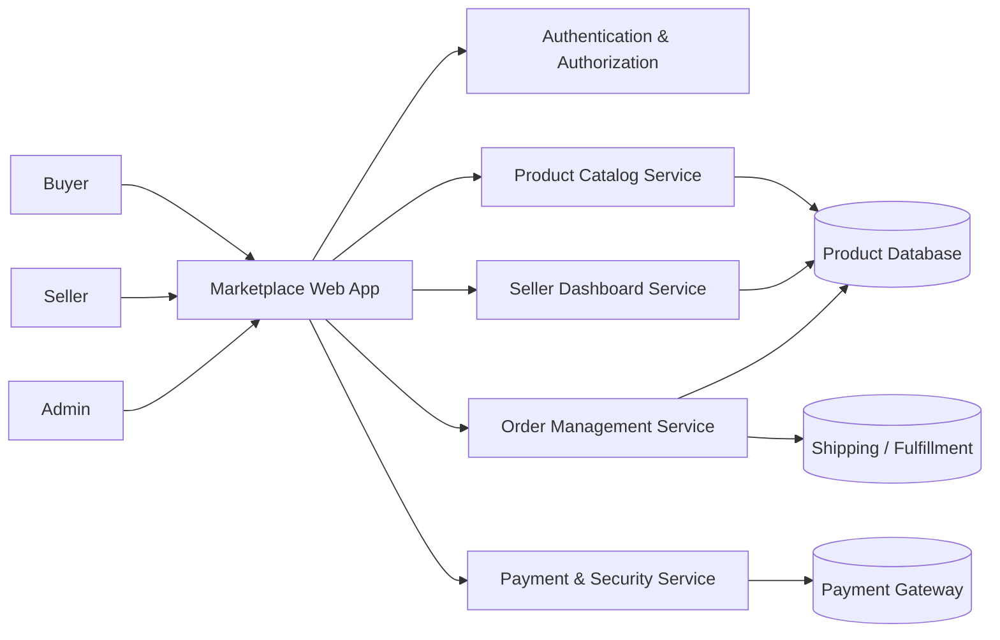
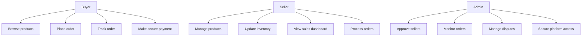
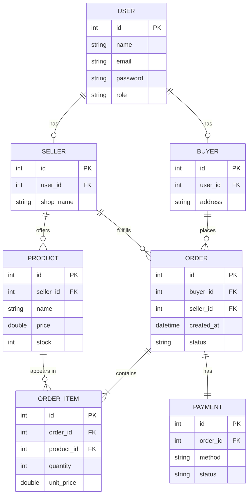
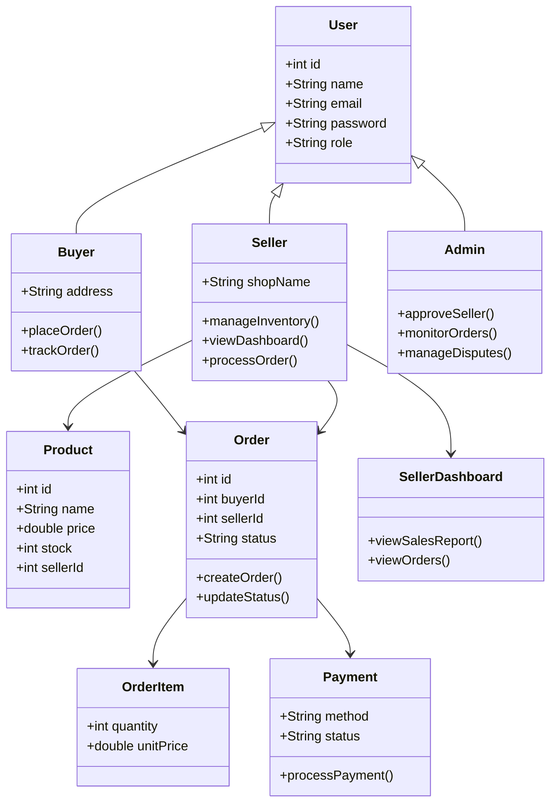
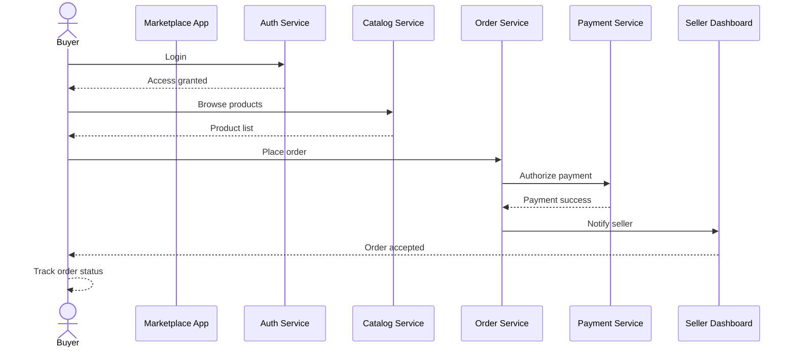
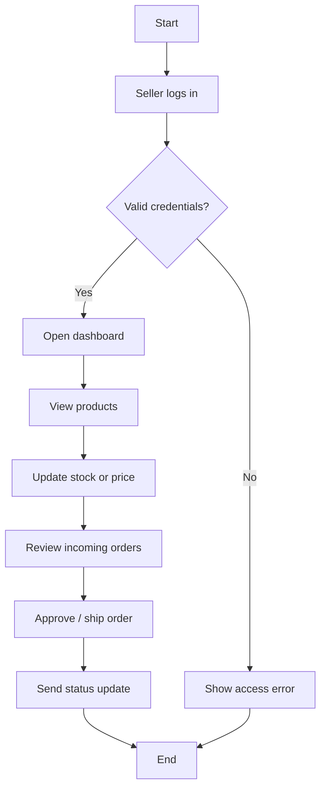
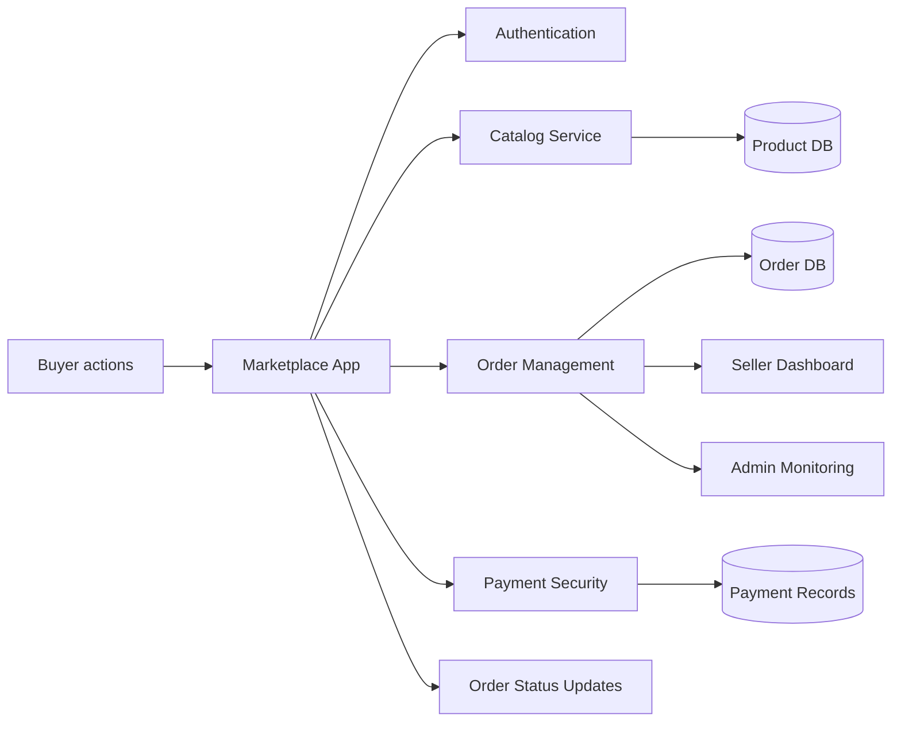

# Multi-Vendor E-commerce Marketplace Diagrams

Project statement: Multi-vendor E-commerce Marketplace with Seller Dashboard and Secure Order Management (Amazon-style).

This document models a marketplace where buyers can browse and purchase products, sellers can manage inventory and sales, and admins can oversee platform security and order processing.

## 1. Architecture Diagram

## 2. Use-Case Diagram

## 3. ER Diagram

## 4. Class Diagram

## 5. Sequence Diagram: Secure Checkout Flow

## 6. Activity Diagram: Seller Dashboard Workflow

## 7. Data-Flow Diagram

## 8. Proposed Architecture Summary

The proposed system follows a layered architecture for a multi-vendor e-commerce marketplace:

- Presentation Layer: buyer, seller, and admin interfaces for browsing products, managing inventory, placing orders, and monitoring transactions.
- Application Layer: services for authentication, catalog management, seller dashboard operations, order processing, and payment security.
- Data Layer: databases for users, products, orders, payments, and inventory records.
- Integration Layer: secure payment gateways, shipping/fulfillment services, and notification modules.

This architecture supports scalability, modular development, and secure order handling. It also allows multiple vendors to operate independently while maintaining centralized control for platform administration and transaction monitoring.
