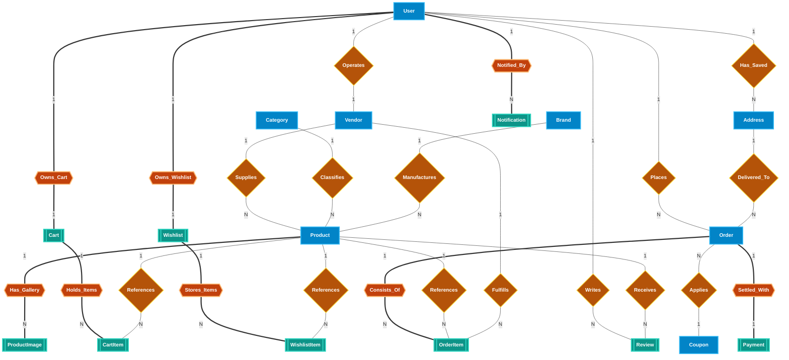
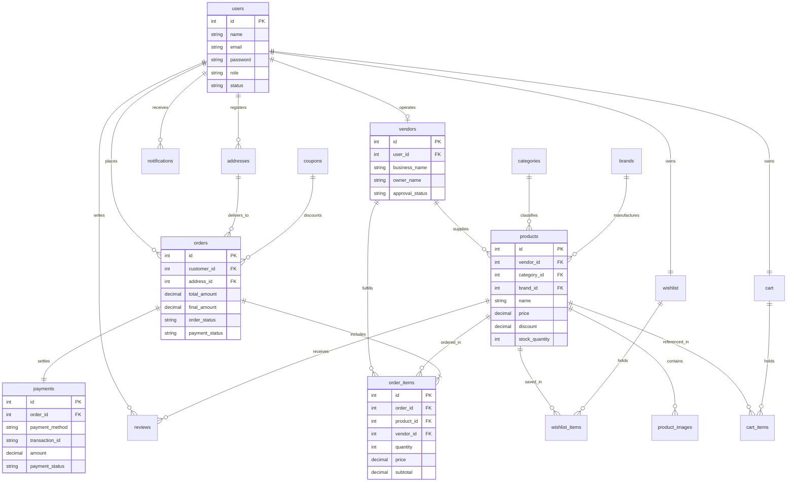

# BuyIt Marketplace — Entity-Relationship Diagram (ERD)

This document provides both the **Traditional Geometric ER Diagram (Peter Chen Notation using Shapes)** and the **Relational Crow's Foot Schema** for the BuyIt Multi-Vendor E-commerce Marketplace.

> **Visual Artifacts:**
> - 🌐 **[Interactive ER Diagram Web App (Pan & Zoom)](er_diagram_traditional.html)**
> - 🖼️ **[Standalone High-Res Vector SVG](er_diagram_traditional.svg)**
> - 📖 **[Comprehensive Traditional ER Documentation](ER_DIAGRAM_TRADITIONAL.md)**

---

## 1. Traditional ER Diagram (Peter Chen Notation Using Shapes)

In traditional Peter Chen ER modeling, the system data architecture is drawn strictly with geometric shapes:
- **Rectangles `[ ]`**: Strong Entities (`User`, `Vendor`, `Category`, `Brand`, `Product`, `Address`, `Order`, `Coupon`)
- **Double Rectangles `[[ ]]`**: Weak Entities (`ProductImage`, `Cart`, `CartItem`, `Wishlist`, `WishlistItem`, `OrderItem`, `Payment`, `Review`, `Notification`)
- **Diamonds `{ }`**: Relationships (`Operates`, `Supplies`, `Classifies`, `Manufactures`, `Places`, `Delivered_To`, `Writes`, `Receives`, `Applies`)
- **Double Diamonds `{{ }}`**: Identifying Relationships (`Has_Gallery`, `Owns_Cart`, `Holds_Items`, `Consists_Of`, `Settled_With`, `Notified_By`)
- **Ovals / Ellipses `( )`**: Attributes (`name`, `price`, `status`, `discount`, `rating`, `payment_method`)
- **Underlined Ovals `( <u>...</u> )`**: Key Attributes (`<u>id (PK)</u>`, `<u>email (UK)</u>`, `<u>code (UK)</u>`)
- **Dashed Ovals `(- - ... - -)`**: Derived Attributes (`discounted_price`, `final_amount`, `subtotal`)

---

## 2. Core Relational Schema (Crow's Foot Notation)

