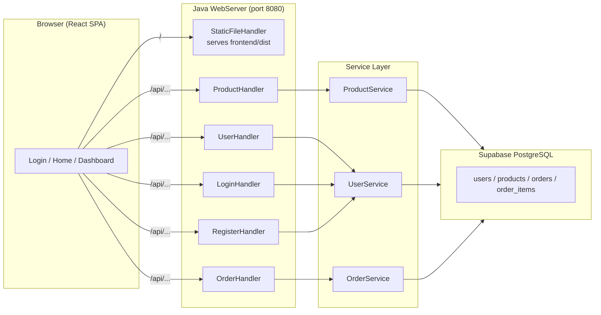
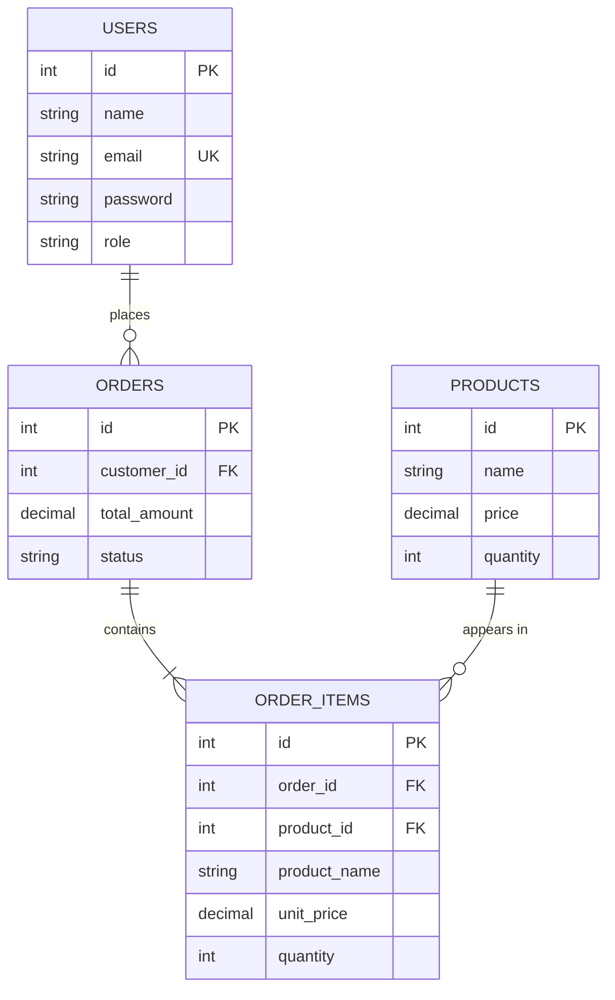
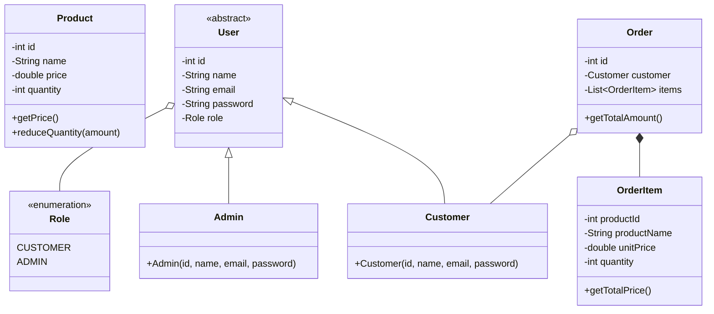
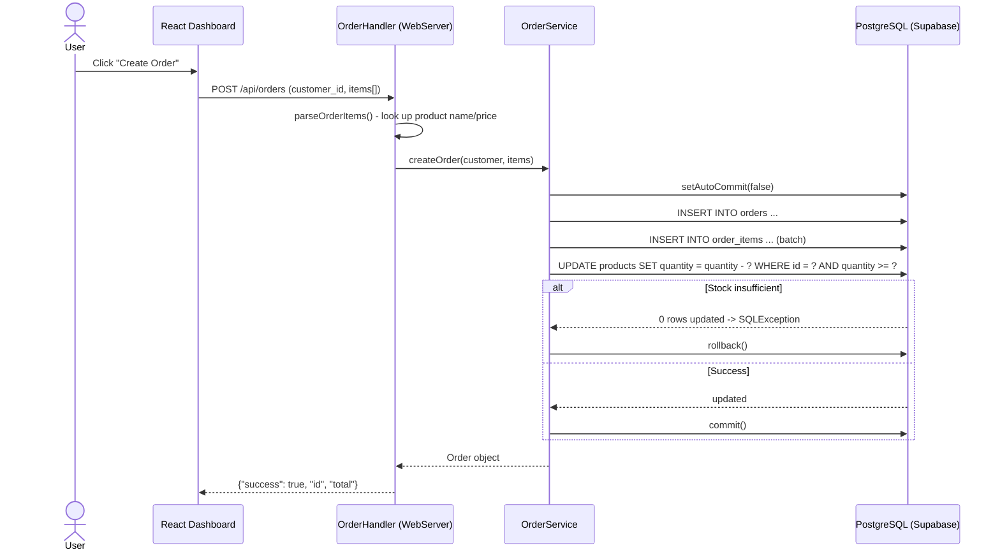
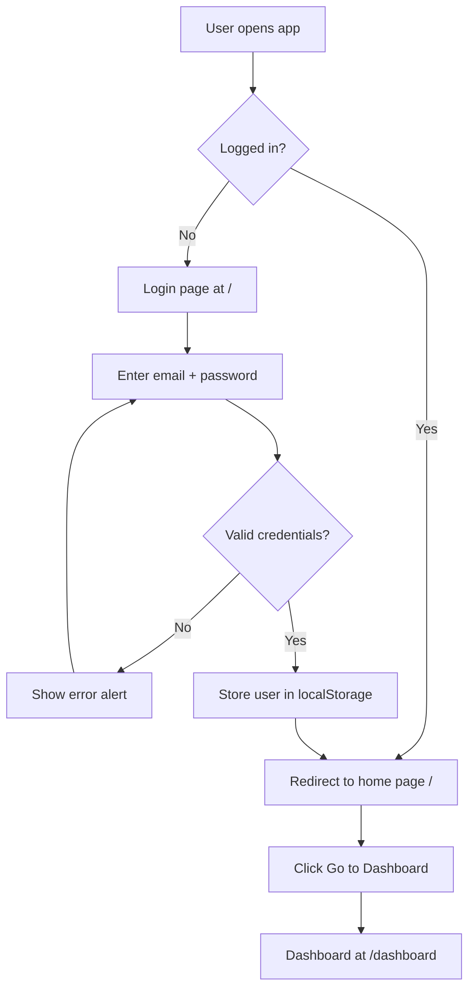

# BuyIt — Study Guide

## 1. Project Overview

BuyIt is a **Multi-Vendor E-Commerce Marketplace** (capstone project) that lets customers browse products, manage carts & wishlists, and place orders, while vendors manage inventory and fulfill sales, and administrators oversee platform operations. It consists of:

- **Backend:** Java (JDK 17+), plain JDBC, and a lightweight multi-threaded HTTP server built on `com.sun.net.httpserver.HttpServer` (zero external frameworks).
- **Frontend:** React 18 + Vite 5 + React Router 6, styled with modern CSS and glassmorphism.
- **Database:** Cloud PostgreSQL hosted on **Supabase**.
- **CLI Management:** Interactive command-line menu built directly into `Main.java` supporting 10 management features alongside the web server.
- **Automated Testing:** Standalone test suite (`TestRunner.java`) verifying schema integrity, polymorphism, stock atomicity, and REST helpers.

Users operate under three distinct roles:
1. **CUSTOMER:** Browse products, filter by category/brand/price, add to cart/wishlist, checkout with promo coupons, view orders and live notifications.
2. **VENDOR:** Merchant portal with sales dashboard, product creation with multi-image URLs, stock updates, and order fulfillment.
3. **ADMIN:** Platform-wide oversight: manage customers, approve/suspend vendors, manage categories & brands, and inspect total gross revenue.

## 2. Tech Stack

| Layer | Technology |
|---|---|
| Language | Java 17+ (tested on JDK 21 and 26) |
| HTTP Server | `com.sun.net.httpserver.HttpServer` (built into the JDK) |
| Database | PostgreSQL (Supabase cloud) |
| JDBC Driver | `postgresql-42.7.4.jar` |
| Frontend | React 18 + Vite 5 + React Router 6 |
| Build Scripts | Root `build.bat` & `run.bat`; `backend/build.bat` & `run.bat` |
| Automated Tests | `TestRunner.java` |

## 3. Folder Structure

```
capstone/
├── build.bat                    # Top-level build script (Frontend + Backend)
├── run.bat                      # Top-level run script
├── backend/
│   ├── Main.java                # Web server + Interactive CLI launcher
│   ├── WebServer.java           # Built-in HttpServer REST API & SPA host
│   ├── TestRunner.java          # Standalone automated test suite
│   ├── build.bat / run.bat      # Backend standalone build & run scripts
│   ├── model/                   # Product, User, Customer, Admin, Vendor, Order, etc.
│   ├── service/                 # ProductService, UserService, OrderService, Cart, etc.
│   ├── db/                      # Database connection pool, SeedPostgresRunner
│   ├── lib/                     # JDBC drivers (PostgreSQL, MySQL)
│   └── resources/               # database.properties configuration
├── frontend/
│   ├── src/App.jsx              # React single-page application (Storefront, Portals)
│   ├── css/style.css            # Stylesheets (glassmorphism, theme, components)
│   ├── dist/                    # Production bundle served by Java WebServer
│   ├── package.json             # React 18, Vite 5, React Router 6
│   └── vite.config.js           # Vite dev proxy configuration
├── amazon-capstone/             # 1000-product image dataset pipeline & mapping
└── docs/                        # Architecture diagrams, ERD, study guides, slides
```

## 4. Database Design (ERD)

The marketplace uses a normalized schema with 15 relational tables in PostgreSQL:

1. **`users`** — Base user credentials (`id`, `name`, `email`, `phone`, `password`, `role`, `status`).
2. **`vendors`** — Vendor merchant profiles (`user_id`, `business_name`, `owner_name`, `approval_status`).
3. **`categories`** — 15 consumer categories (`name`, `description`, `image`).
4. **`brands`** — Brand catalog entries (`name`, `description`, `logo`).
5. **`products`** — 1,000 product catalog entries (`vendor_id`, `category_id`, `brand_id`, `price`, `discount`, `stock_quantity`, `sku`, `image`).
6. **`product_images`** — 3,000 multi-image records linked to products.
7. **`addresses`** — Customer delivery addresses (`customer_id`, `address_line`, `city`, `state`, `pincode`).
8. **`coupons`** — Promo discount codes (`code`, `discount_percent`, `min_amount`).
9. **`orders`** — Placed orders (`customer_id`, `address_id`, `total_amount`, `discount_amount`, `final_amount`, `order_status`).
10. **`order_items`** — Snapshot line items (`order_id`, `product_id`, `vendor_id`, `product_name`, `price`, `quantity`, `subtotal`).
11. **`payments`** — Transaction records (`order_id`, `payment_method`, `transaction_id`, `amount`, `payment_status`).
12. **`cart` & `cart_items`** — Persistent customer shopping cart state.
13. **`wishlist` & `wishlist_items`** — Customer saved product wishlists.
14. **`reviews`** — Product ratings and feedback (`rating`, `comment`, `customer_id`, `product_id`).
15. **`notifications`** — User notification feed (`user_id`, `title`, `message`, `is_read`).

> Why keep `product_name` and `price` in `order_items`?
> Because a product can subsequently change name or price, or be archived. The order line item preserves an immutable historical **snapshot** of what was charged at the moment of purchase.

## 5. Backend Layers (3-tier Architecture)

### 5.1 Model Layer (`backend/model/`)
- `User` (abstract base) + `Customer`, `VendorUser`, `Admin` (concrete subclasses demonstrating OOP inheritance and polymorphism).
- `Product` — encapsulates price, discount calculation (`getFinalPrice()`), and stock validation (`reduceQuantity(amount)`).
- `Order` & `OrderItem` — encapsulate multi-item totals, shipping calculations, and immutable line snapshots.
- `CartItem`, `Brand`, `Category`, `Address`, `Review`, `Notification`.

### 5.2 Service Layer (`backend/service/`)
- `ProductService`: CRUD, multi-parameter search, stock checks (`hasSufficientStock`), and atomic stock reduction (`reduceStock`).
- `UserService`: User management, email lookup, role counts, and polymorphic mapping.
- `OrderService`: Transactional order placement with atomic stock decrements and rollback safety (`createOrder`), status updates, and cancellation.
- `CartService` & `WishlistService`: Customer cart and wishlist persistence.
- `VendorService`, `CategoryService`, `BrandService`, `CouponService`, `NotificationService`.

### 5.3 Database Layer (`backend/db/Database.java`)
- Connection pool (`BlockingQueue<Connection>`) managing JDBC connections with dynamic proxy wrapping for safe connection recycling.
- Startup catalog guard preserving existing data if tables already exist.

## 6. REST API Reference (WebServer.java)

Built using the JDK's built-in `HttpServer` with JSON responses and CORS support:

| Method & Path | Purpose | Role / Auth |
|---|---|---|
| `POST /api/auth/login` | Authenticate user, issue session token | Public |
| `POST /api/auth/register` | Register customer or vendor | Public |
| `POST /api/auth/logout` | Invalidate current session token | Authenticated |
| `GET /api/auth/me` | Fetch authenticated user profile | Authenticated |
| `GET /api/products` | Search catalog with filters & sorting | Public |
| `GET /api/products/{id}` | Product details with image gallery | Public |
| `POST /api/products` | Add new product | Vendor / Admin |
| `PUT /api/products/{id}` | Update product or stock | Vendor / Admin |
| `DELETE /api/products/{id}` | Remove product | Admin |
| `GET /api/categories` | List catalog categories | Public |
| `POST /api/categories` | Create category | Admin |
| `GET /api/brands` | List brands | Public |
| `POST /api/brands` | Create brand | Admin |
| `GET /api/users` | List users (supports `?role=...`) | Admin |
| `GET /api/users/{id}` | User profile by ID | Authenticated |
| `POST /api/users` | Add user (Customer, Vendor, Admin) | Admin |
| `DELETE /api/users/{id}` | Delete user | Admin |
| `GET /api/cart` | Get cart items & total | Customer |
| `POST /api/cart` | Add product to cart | Customer |
| `DELETE /api/cart` | Clear or remove from cart | Customer |
| `GET /api/wishlist` | Get saved wishlist items | Customer |
| `POST /api/wishlist` | Add product to wishlist | Customer |
| `DELETE /api/wishlist` | Remove from wishlist | Customer |
| `GET /api/orders` | List orders (role-scoped) | Authenticated |
| `GET /api/orders/{id}` | Single order details with items | Authenticated |
| `POST /api/orders` | Transactional order placement | Customer |
| `PUT /api/orders/{id}/status`| Update order status | Vendor / Admin |
| `POST /api/orders/{id}/cancel`| Cancel order and restore stock | Customer |
| `GET /api/admin/stats` | Admin platform metrics & KPIs | Admin |
| `GET /api/notifications` | User notifications & unread count | Authenticated |
| `POST /api/notifications/read`| Mark notifications as read | Authenticated |

Notes:
- JSON is built **manually** with string formatting (no JSON library). `extractJsonValue` and `splitJsonObjects` are simple parser helpers.
- Static files: serves the built React app from `frontend/dist`; any non-API path falls back to the React shell (SPA routing support).
- CORS is handled via `OPTIONS` pre-flight responses and `Access-Control-Allow-Origin: *`.

## 7. Key Flows (explain these in a viva)

### 7.1 Login
1. Frontend `handleLogin` POSTs `{email, password}` to `/api/auth/login`.
2. `LoginHandler` streams all users and matches email (case-insensitive) + exact password.
3. On success, the frontend stores the user in `localStorage`, sets `isLoggedIn`, and (after the recent change) redirects to the **home page** `/` instead of `/dashboard`.

### 7.2 Create Order — transaction & stock
`OrderService.createOrder` is a good example of **transactional behavior**:

1. Opens one `Connection`, sets `setAutoCommit(false)`.
2. Computes `orderId` and `totalAmount`.
3. Inserts the order row.
4. Inserts all `order_items` in a batch (ids allocated from `MAX(id)+1`).
5. Runs `UPDATE products SET quantity = quantity - ? WHERE id = ? AND quantity >= ?` for each item — if any row is not updated (insufficient stock), it throws `SQLException`.
6. `commit()`; on any failure `rollback()` restores all changes.

Why transactions matter: order + items + stock reduction must all succeed or all fail together — otherwise you could get an order without items, or stock reduced without an order.

## 8. Frontend (React)

Single `App.jsx` contains all pages:

- **`App`** — holds the logged-in `user` in state, defines `handleLogin` / `handleRegister`, renders the navbar + routes.
- **`LoginPage`** — email/password/remember-me form; validates email format.
- **`RegisterPage`** — full name, email, phone, password + confirm; validates password ≥ 6 chars, matching confirm, valid phone.
- **`HomePage`** (new) — landing page shown after login with About / Services / Contact sections and a "Go to Dashboard" button.
- **`DashboardPage`** — the main management screen:
  - Sidebar with Overview / Products / Orders / Users / Settings tabs.
  - Overview: stat cards (total products, orders, users, revenue).
  - Products: table with Add/Edit/Delete via modals (`ProductModal`).
  - Orders: table + `OrderModal` (choose customer, add multiple line items, live total).
  - Users: table + `UserModal` (name/email/password/role).
  - Settings: edit name/email (stored only in `localStorage`).
- API helpers `getJson` / `sendJson` call `/api/...`.

**How the frontend talks to the backend:** `API_BASE = '/api'` — same origin, so the Vite dev server is normally proxied or the app is served directly by the Java server at `http://localhost:8080`.

## 9. Diagrams

### 9.1 System Architecture



### 9.2 ER Diagram (database)



### 9.3 Class Diagram



### 9.4 Sequence Diagram — Create Order (transaction)



### 9.5 Activity Diagram — Login → Home



## 10. How to Run

**Backend (serves the built React app):**
```
cd backend
build.bat
run.bat
```
Open http://localhost:8080

**Frontend dev server (optional):**
```
cd frontend
npm install
npm run dev     # http://localhost:3000
npm run build   # rebuild frontend/dist for the Java server
```

**Test accounts:**
- Admin: `admin@example.com` / `adminpass`
- Customer: `asha@example.com` / `pass1234`
- Customer: `testuser@example.com` / `test123`

## 11. Likely Viva / Interview Questions

1. What is the project about and what stack does it use?
2. Why is the backend a three-layer design (model / service / db)?
3. Explain the table relationships. Why is `order_items` needed?
4. Why do we store `product_name` and `unit_price` inside `order_items`? (snapshot/history)
5. How is an order created? Why use a DB transaction?
6. How is stock checked and reduced atomically? (the `WHERE quantity >= ?` trick)
7. What does `mapUser` do and why is `User` abstract? (polymorphism)
8. How does the login work? What happens in the frontend on success?
9. How does the app serve both React (SPA) and JSON APIs from one server?
10. What happens if you try to delete a product that appears in an order? (FK `ON DELETE RESTRICT` blocks it)
11. What is CORS and why is it handled here?
12. Security weaknesses to discuss honestly: passwords stored in plain text, no JWT/session tokens, no role-based access control, naive JSON parsing.

## 12. Suggested Improvements (impress the reviewer)

- Hash passwords (e.g. bcrypt) and never return the password column.
- Add real auth tokens / sessions and role-based route guards on the backend.
- Use a proper JSON library (Jackson/Gson) and `PreparedStatement` everywhere (already used for data, good).
- Use DB `SERIAL`/`IDENTITY` sequences instead of `MAX(id)+1`.
- Add input validation, error handling, and automated tests.
