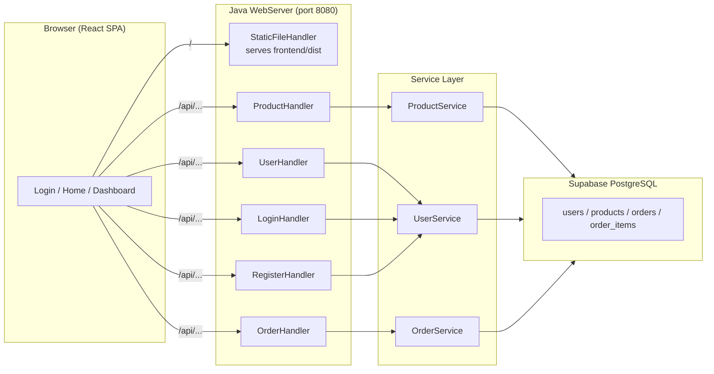
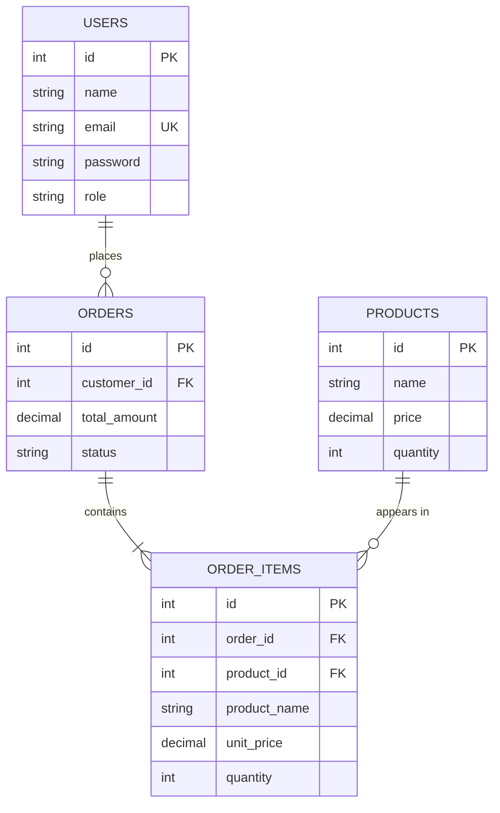
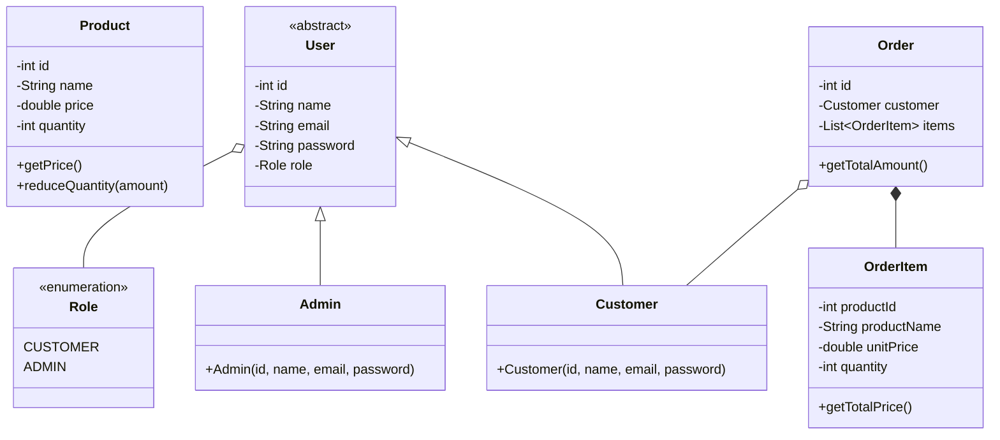
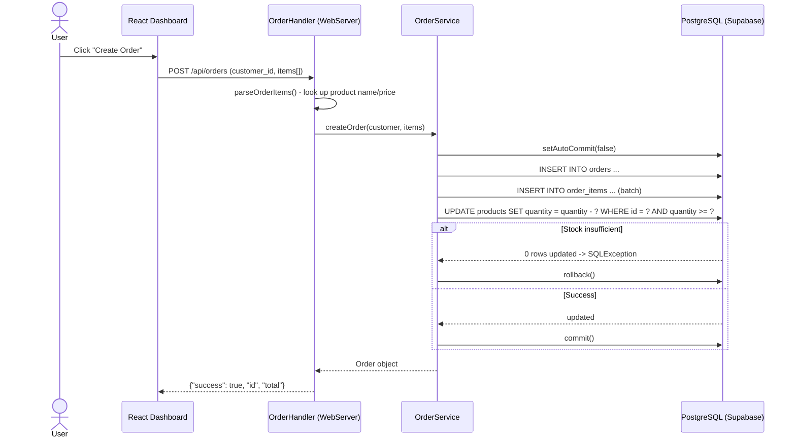
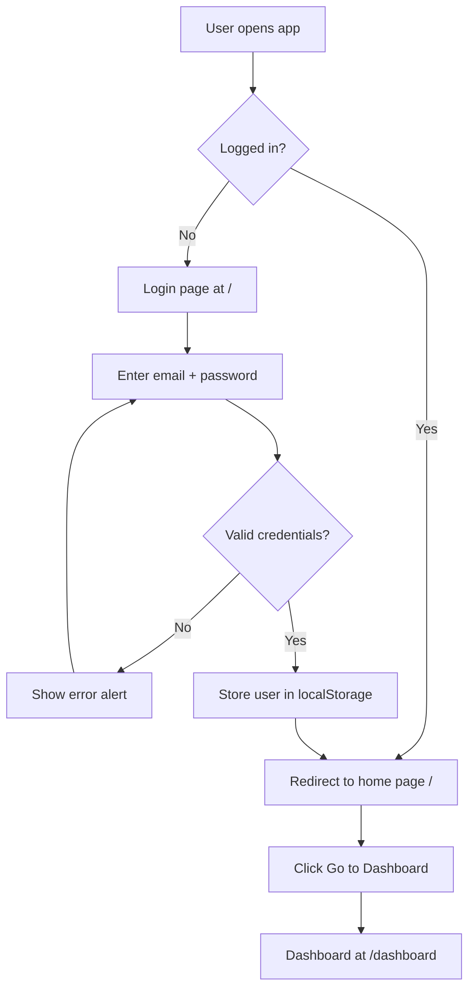

# BuyIt — Study Guide

## 1. Project Overview

BuyIt is a **shop management system** (capstone project) that lets users browse products, place orders, and manage inventory. It has two parts:

- **Backend:** Java (JDK 17+), plain JDBC, and a lightweight HTTP server built on `com.sun.net.httpserver.HttpServer` (no Spring).
- **Frontend:** React (Vite) + React Router, styled with plain CSS.
- **Database:** PostgreSQL hosted on **Supabase** (cloud).

Users come in two roles: **ADMIN** (manage everything) and **CUSTOMER** (shop / place orders). Currently there is no role restriction in the backend — both roles can access the same dashboard.

## 2. Tech Stack

| Layer | Technology |
|---|---|
| Language | Java 17+ (tested on 25) |
| HTTP server | `com.sun.net.httpserver.HttpServer` (built into the JDK) |
| Database | PostgreSQL (Supabase) |
| JDBC driver | `postgresql-42.7.4.jar` |
| Frontend | React 18 + Vite 5 + React Router 6 |
| Build (backend) | `build.bat` / manual `javac` |
| Build (frontend) | `npm run build` → outputs `frontend/dist` |

## 3. Folder Structure

```
capstone/
├── backend/
│   ├── Main.java            # CLI entry point + starts web server + browser
│   ├── WebServer.java       # REST API handlers + static file server
│   ├── model/               # Product, User, Customer, Admin, Role, Order, OrderItem
│   ├── service/             # ProductService, UserService, OrderService
│   ├── db/Database.java     # DB connection, table auto-create, seed data
│   ├── resources/database.properties  # Supabase URL/user/password
│   └── database/schema.sql  # Full SQL schema + seed
├── frontend/
│   ├── src/App.jsx          # All React pages (login, register, dashboard, home)
│   ├── src/main.jsx         # React entry point
│   ├── css/                 # style.css, dashboard.css
│   └── dist/                # Built app served by the Java backend
└── docs/                    # Diagrams, ERD, this guide
```

## 4. Database Design (ERD)

4 tables in a PostgreSQL/Supabase database.

**users**
| Column | Type | Notes |
|---|---|---|
| id | INT PK | manual IDs |
| name | VARCHAR(100) | |
| email | VARCHAR(100) | UNIQUE |
| password | VARCHAR(255) | plain text (not hashed in this project) |
| role | VARCHAR(50) | CHECK IN ('CUSTOMER','ADMIN') |
| created_at / updated_at | TIMESTAMP | auto |

**products**
| Column | Type | Notes |
|---|---|---|
| id | INT PK | |
| name | VARCHAR(255) | |
| price | DECIMAL(10,2) | CHECK >= 0 |
| quantity | INT | CHECK >= 0 |

**orders**
| Column | Type | Notes |
|---|---|---|
| id | INT PK | |
| customer_id | INT FK → users.id | ON DELETE CASCADE |
| total_amount | DECIMAL(10,2) | |
| status | VARCHAR(50) | default 'Pending' |

**order_items** (junction/line items)
| Column | Type | Notes |
|---|---|---|
| id | INT PK | |
| order_id | INT FK → orders.id | ON DELETE CASCADE |
| product_id | INT FK → products.id | ON DELETE RESTRICT |
| product_name | VARCHAR(255) | snapshot of name at order time |
| unit_price | DECIMAL(10,2) | snapshot of price at order time |
| quantity | INT | CHECK > 0 |

**Relationships:** `users 1—* orders` · `orders 1—* order_items` · `products 1—* order_items`

> Why keep `product_name` and `unit_price` in order_items? Because a product can later change name/price or be deleted. The order must keep the price that was charged — this is called a **snapshot** / denormalized copy.

## 5. Backend Layers (3-tier)

### 5.1 Model layer (`backend/model/`)
Plain POJOs that mirror the database:

- `Product` — immutable id/name/price; `quantity` mutable; `reduceQuantity(amount)` validates stock.
- `User` — **abstract** base class with `role` as a final `Role` enum field.
- `Customer extends User` — role fixed to `CUSTOMER`.
- `Admin extends User` — role fixed to `ADMIN`.
- `Role` — enum `{ CUSTOMER, ADMIN }`.
- `Order` — validates it has ≥1 item; `getTotalAmount()` = sum of line totals.
- `OrderItem` — product id, name snapshot, unit price, quantity; `getTotalPrice() = unitPrice * quantity`.

Inheritance lets services work with any `User` and lets the DB layer map a row back to `Admin` or `Customer` based on the role column.

### 5.2 Service layer (`backend/service/`)
Business logic + SQL access.

**ProductService**
- `addProduct` — rejects duplicate IDs.
- `getAllProducts` / `getProductById` / `nextProductId` (MAX(id)+1).
- `updateProduct` — used by the edit feature (PUT).
- `removeProductById`.
- `hasSufficientStock(productId, qty)` — SELECT quantity and compare.
- `reduceProductQuantity(id, amount)` — `UPDATE ... SET quantity = quantity - ? WHERE id = ? AND quantity >= ?` — the `WHERE quantity >= ?` makes the stock check **atomic** (no race condition).

**UserService**
- `addUser` / `removeUserById` / `getAllUsers` / `getUserById` / `nextUserId`.
- `getUsersByRole(Role)`.
- `mapUser(ResultSet)` — reads the role column and constructs `Admin` or `Customer` (polymorphism).

**OrderService**
- `createOrder(customer, items)` — **the most important method** (see 7.2).
- `getAllOrders`, `getOrderById`, `getOrdersByCustomerId`.
- Uses `fetchCustomer` and `fetchOrderItems` to rebuild full objects with JOIN-like queries.

### 5.3 DB layer (`backend/db/Database.java`)
- Loads `database.properties` from the classpath.
- `getConnection()` returns a JDBC `Connection`.
- `initialize()` runs `CREATE TABLE IF NOT EXISTS ...` so tables are auto-created on startup, then calls `seedData()` (admin, customer Asha, and 3 starter products).
- Passwords, URL, user are read from `resources/database.properties`.

## 6. REST API (WebServer.java)

Built with `HttpServer` — each context maps to one handler class.

| Method & Path | Purpose |
|---|---|
| POST `/api/auth/login` | Checks email + password against users, returns user JSON |
| POST `/api/auth/register` | Creates a new CUSTOMER (auto-assigned id) |
| GET `/api/products` | List all products |
| POST `/api/products` | Add product (id = max+1) |
| PUT `/api/products/{id}` | Update name/price/quantity |
| DELETE `/api/products/{id}` | Delete product |
| GET `/api/orders` | List orders with customer + item count |
| POST `/api/orders` | Create order (customer_id + items array) |
| GET `/api/users` | List users |
| POST `/api/users` | Add user (role selectable) |
| DELETE `/api/users/{id}` | Delete user |

Notes:
- JSON is built **manually** with string formatting (no JSON library). `extractJsonValue` and `splitJsonObjects` are simple parser helpers.
- Static files: serves the built React app from `frontend/dist`; any non-API path falls back to the React shell (SPA routing support).
- CORS is handled via `OPTIONS` pre-flight responses and `Access-Control-Allow-Origin: *`.

## 7. Key Flows (explain these in a viva)

### 7.1 Login
1. Frontend `handleLogin` POSTs `{email, password}` to `/api/auth/login`.
2. `LoginHandler` streams all users and matches email (case-insensitive) + exact password.
3. On success, the frontend stores the user in `localStorage`, sets `isLoggedIn`, and (after the recent change) redirects to the **home page** `/` instead of `/dashboard`.

### 7.2 Create Order — transaction & stock
`OrderService.createOrder` is a good example of **transactional behavior**:

1. Opens one `Connection`, sets `setAutoCommit(false)`.
2. Computes `orderId` and `totalAmount`.
3. Inserts the order row.
4. Inserts all `order_items` in a batch (ids allocated from `MAX(id)+1`).
5. Runs `UPDATE products SET quantity = quantity - ? WHERE id = ? AND quantity >= ?` for each item — if any row is not updated (insufficient stock), it throws `SQLException`.
6. `commit()`; on any failure `rollback()` restores all changes.

Why transactions matter: order + items + stock reduction must all succeed or all fail together — otherwise you could get an order without items, or stock reduced without an order.

## 8. Frontend (React)

Single `App.jsx` contains all pages:

- **`App`** — holds the logged-in `user` in state, defines `handleLogin` / `handleRegister`, renders the navbar + routes.
- **`LoginPage`** — email/password/remember-me form; validates email format.
- **`RegisterPage`** — full name, email, phone, password + confirm; validates password ≥ 6 chars, matching confirm, valid phone.
- **`HomePage`** (new) — landing page shown after login with About / Services / Contact sections and a "Go to Dashboard" button.
- **`DashboardPage`** — the main management screen:
  - Sidebar with Overview / Products / Orders / Users / Settings tabs.
  - Overview: stat cards (total products, orders, users, revenue).
  - Products: table with Add/Edit/Delete via modals (`ProductModal`).
  - Orders: table + `OrderModal` (choose customer, add multiple line items, live total).
  - Users: table + `UserModal` (name/email/password/role).
  - Settings: edit name/email (stored only in `localStorage`).
- API helpers `getJson` / `sendJson` call `/api/...`.

**How the frontend talks to the backend:** `API_BASE = '/api'` — same origin, so the Vite dev server is normally proxied or the app is served directly by the Java server at `http://localhost:8080`.

## 9. Diagrams

### 9.1 System Architecture



### 9.2 ER Diagram (database)



### 9.3 Class Diagram



### 9.4 Sequence Diagram — Create Order (transaction)



### 9.5 Activity Diagram — Login → Home



## 10. How to Run

**Backend (serves the built React app):**
```
cd backend
build.bat
run.bat
```
Open http://localhost:8080

**Frontend dev server (optional):**
```
cd frontend
npm install
npm run dev     # http://localhost:3000
npm run build   # rebuild frontend/dist for the Java server
```

**Test accounts:**
- Admin: `admin@example.com` / `adminpass`
- Customer: `asha@example.com` / `pass1234`
- Customer: `testuser@example.com` / `test123`

## 11. Likely Viva / Interview Questions

1. What is the project about and what stack does it use?
2. Why is the backend a three-layer design (model / service / db)?
3. Explain the table relationships. Why is `order_items` needed?
4. Why do we store `product_name` and `unit_price` inside `order_items`? (snapshot/history)
5. How is an order created? Why use a DB transaction?
6. How is stock checked and reduced atomically? (the `WHERE quantity >= ?` trick)
7. What does `mapUser` do and why is `User` abstract? (polymorphism)
8. How does the login work? What happens in the frontend on success?
9. How does the app serve both React (SPA) and JSON APIs from one server?
10. What happens if you try to delete a product that appears in an order? (FK `ON DELETE RESTRICT` blocks it)
11. What is CORS and why is it handled here?
12. Security weaknesses to discuss honestly: passwords stored in plain text, no JWT/session tokens, no role-based access control, naive JSON parsing.

## 12. Suggested Improvements (impress the reviewer)

- Hash passwords (e.g. bcrypt) and never return the password column.
- Add real auth tokens / sessions and role-based route guards on the backend.
- Use a proper JSON library (Jackson/Gson) and `PreparedStatement` everywhere (already used for data, good).
- Use DB `SERIAL`/`IDENTITY` sequences instead of `MAX(id)+1`.
- Add input validation, error handling, and automated tests.
